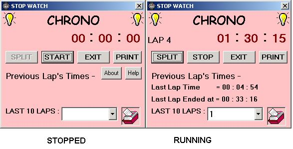



## A   0 Cool \-STOP WATCH

### Description

This code shows make form, modules and how to use command button, pictures, combo box,timers etc. while start learning VB.This code also shows some advanced concepts like running the application in background (system tray) and how to make your form stay on top of all the running applications.
 
### More Info
 
Knowledge of Visula Basic 6.0

             |
---                |---
**Submitted On**   |2002-07-19 18:29:54
**By**             |[Parmender Dahiya](https://github.com/Planet-Source-Code/PSCIndex/blob/master/ByAuthor/parmender-dahiya.md)
**Level**          |Intermediate
**User Rating**    |4.3 (30 globes from 7 users)
**Compatibility**  |VB 6\.0
**Category**       |[Complete Applications](https://github.com/Planet-Source-Code/PSCIndex/blob/master/ByCategory/complete-applications__1-27.md)
**World**          |[Visual Basic](https://github.com/Planet-Source-Code/PSCIndex/blob/master/ByWorld/visual-basic.md)
**Archive File**   |[STOP\_WATCH1081207192002\.zip](https://github.com/Planet-Source-Code/parmender-dahiya-a-0-cool-stop-watch__1-37069/archive/master.zip)

### API Declarations

Shell_NotifyIcon, SetWindowPos

